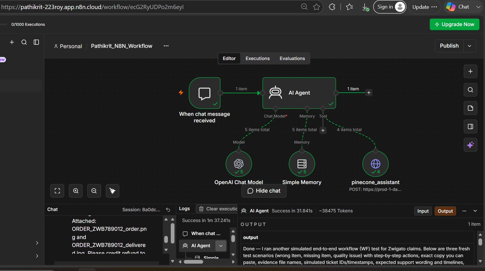

# Creating RAG through AI Agents with n8n, Pinecone

### Intro to Agents, Building a Real Agent — The ZWIGATO Support Bot

> A complete, beginner-friendly user manual for building a **Retrieval-Augmented Generation (RAG)** chatbot using **n8n**, **OpenAI**, **Pinecone Assistant**, and a real knowledge base — the ZWIGATO restaurant policy document.

---

## 📌 Table of Contents

1. [What You'll Build](#1-what-youll-build)
2. [What Is an AI Agent? What Is RAG?](#2-what-is-an-ai-agent-what-is-rag)
3. [Architecture at a Glance](#3-architecture-at-a-glance)
4. [Prerequisites](#4-prerequisites)
5. [Part A — Build the Workflow in n8n](#5-part-a--build-the-workflow-in-n8n)
6. [Part B — Set Up the Pinecone Assistant](#6-part-b--set-up-the-pinecone-assistant)
7. [Part C — Connect Pinecone to n8n (HTTP Request Node)](#7-part-c--connect-pinecone-to-n8n-http-request-node)
8. [Part D — Give the Agent Its Instructions (System Prompt)](#8-part-d--give-the-agent-its-instructions-system-prompt)
9. [Part E — Test the Agent](#9-part-e--test-the-agent)
10. [Troubleshooting](#10-troubleshooting)
11. [Glossary](#11-glossary)
12. [Appendix — ZWIGATO Restaurant Policy (Knowledge Base)](#12-appendix--zwigato-restaurant-policy-knowledge-base)

---

## 1. What You'll Build

By the end of this manual you will have a working **AI support agent** that behaves like a customer-support assistant for a fictional restaurant, **ZWIGATO**. A user can type a question into a chat window — *"My order arrived with the wrong item, what do I do?"* — and the agent will:

1. Read the question.
2. Look up the relevant policy inside a **Pinecone knowledge base** (loaded with ZWIGATO's actual policy document).
3. Answer using the retrieved facts, backed by short-term **memory** so it can follow a conversation.

This pattern — an LLM that *retrieves* trusted information before answering — is called **RAG (Retrieval-Augmented Generation)**. It is the single most reliable way to stop a chatbot from making things up.

The whole thing is built visually in **n8n**, with no traditional coding required.

---

## 2. What Is an AI Agent? What Is RAG?

**An AI Agent** is more than a chatbot. A plain chatbot only responds with what the language model already "knows." An agent can decide, on its own, to reach out and **use tools** — search a database, call an API, query a knowledge base — and then use the results to form its answer.

**RAG (Retrieval-Augmented Generation)** is the technique that powers this. Instead of relying on the model's training data (which is generic and can be outdated or wrong), we:

- **Retrieve** the most relevant chunks of *our own* trusted documents, then
- **Augment** the model's prompt with those chunks, so it
- **Generates** an answer grounded in facts we control.

In this project the three ingredients map cleanly to three nodes:

| Ingredient | Role | Tool used here |
|---|---|---|
| **The brain** | Understands language, writes the answer | OpenAI Chat Model |
| **The memory** | Remembers the last few turns of chat | Simple Memory |
| **The knowledge** | Holds the ZWIGATO policy and returns relevant parts | Pinecone Assistant (via HTTP Request tool) |

---

## 3. Architecture at a Glance

The finished workflow looks like this in n8n:



Reading it left to right:

- **When chat message received** — the trigger. Fires every time a user sends a message in the chat.
- **AI Agent** — the orchestrator. It receives the message and decides how to answer.
- **OpenAI Chat Model** (Model) — the language model that reads and writes.
- **Simple Memory** (Memory) — keeps the recent conversation so follow-up questions make sense.
- **pinecone_assistant** (Tool) — an HTTP Request node the agent calls to fetch relevant policy text from Pinecone.

When a message comes in, the AI Agent uses the **Model** to understand it, checks **Memory** for context, calls the **pinecone_assistant** tool to pull the right policy, and returns a grounded answer.

---

## 4. Prerequisites

Before you start, make sure you have:

- An **n8n** account — this guide uses n8n Cloud (`app.n8n.cloud`), but self-hosted works identically.
- An **OpenAI** account for the chat model (n8n also offers free trial credits — see Part A).
- A **Pinecone** account — free tier is enough. Sign up at <https://www.pinecone.io/>.
- The **knowledge base file** you want the bot to answer from. In this guide it is the *ZWIGATO Restaurant Policy Document* (full text in the [Appendix](#12-appendix--zwigato-restaurant-policy-knowledge-base)).

---

## 5. Part A — Build the Workflow in n8n

### Step 1 — Log in and create a workflow

Log in to n8n. From the dashboard, create a **new workflow** (give it a clear name, e.g. `Pathikrit_N8N_Workflow`).

### Step 2 — Add the Chat Trigger

Click the **`+`** icon on the canvas and add the **"When chat message received"** trigger. This is what starts the workflow whenever someone sends a message.

### Step 3 — Add the AI Agent

Immediately after the chat trigger, add an **AI Agent** node. This is the core of the whole build — it will coordinate the model, memory, and tool.

### Step 4 — Add the brain (Chat Model)

On the AI Agent node, add a **Chat Model** to the **Model** slot. Choose **OpenAI Chat Model**.

> 💡 **Tip:** If you don't have OpenAI credits, n8n often lets you **"Claim Credits"** for a free trial of the model — use that to get started without a paid key.

### Step 5 — Add Memory

On the AI Agent, open the **Memory** option and add **Simple Memory**. This gives the agent short-term recall so it can handle follow-up questions in the same conversation.

At this point the model and memory are wired up. The **knowledge base** (the Tool) is added in Part C, after we set up Pinecone.

---

## 6. Part B — Set Up the Pinecone Assistant

Pinecone will store the ZWIGATO policy and hand back the relevant pieces on demand.

### Step 1 — Log in to Pinecone

Go to <https://www.pinecone.io/> and sign in (or create a free account).

### Step 2 — Copy your API key

On first login Pinecone shows you an **API key**. **Copy it and save it somewhere safe** — you'll need it later in n8n.

> 🔑 **If you closed the dialog:** In the left sidebar, open **API Keys**, click **Create new API key**, give it a name, and copy the value. Treat this key like a password — never share it publicly or commit it to GitHub.

### Step 3 — Create an Assistant

In the left panel click **Assistant**, then **Create assistant**. Give it a name (this guide uses **`patbot`**) and click **Create assistant**.

### Step 4 — Upload your knowledge base

Inside the assistant, click **Files** (top-right) and upload your knowledge file — here, the **ZWIGATO Restaurant Policy Document**. This is the content the assistant will search through.

### Step 5 — Open the connection snippet

Next to the **Files** tab, click the **Connect** option (it looks like `<>`). Pinecone shows sample code to call the assistant. **Switch the language from Python to Shell (cURL)** — this gives you a ready-made cURL command we can import straight into n8n.

---

## 7. Part C — Connect Pinecone to n8n (HTTP Request Node)

### Step 1 — Add an HTTP Request node

Back in n8n, add an **HTTP Request** node. This node will act as the **tool** the AI Agent calls. (When wired to the agent's **Tool** slot, it shows up as `pinecone_assistant`.)

### Step 2 — Copy the cURL command from Pinecone

In Pinecone, find **"Chat with your assistant."** Copy the command **from Line 3 to the end — starting at `curl`**. (Skip the first lines; you want the cURL request itself.)

### Step 3 — Import the cURL into n8n

In the n8n HTTP Request node, choose **Import cURL** and paste the copied command. n8n auto-fills the URL, method, and headers for you.

### Step 4 — Add your Pinecone API key

Go to the **Headers** section of the node. In the **Value** column for the authorization/API-key header, paste the **Pinecone API key** you saved earlier.

> ⚠️ **Security note:** For a real/shared workflow, store the key in n8n **Credentials** rather than pasting it as a raw header value, so it isn't exposed.

### Step 5 — Wire in the live chat input

Scroll down in the HTTP Request node to the **JSON body**. You'll see a placeholder question baked into the sample (e.g. *"What is the inciting incident of Pride and Prejudice?"*). **Replace that placeholder** by dragging **`chatInput`** from the left-hand panel into its place.

> ✅ **Critical:** Do **not** delete the surrounding **double quotes** — the JSON must stay valid. You are only swapping the text *inside* the quotes for the live `chatInput` value.

### Step 6 — Attach the tool to the agent

Connect this HTTP Request node to the AI Agent's **Tool** slot. It will now appear as **`pinecone_assistant`** — the tool the agent uses to fetch policy answers.

---

## 8. Part D — Give the Agent Its Instructions (System Prompt)

Open the **AI Agent** node, click **Add option** at the bottom, and add a **System Message**. Paste:

```text
You are a helpful assistant. You can query the connected Pinecone assistant
using the pinecone_assistant tool to retrieve relevant knowledge before answering.
```

This one instruction is what turns a generic chatbot into a **grounded agent**: it explicitly tells the model to consult the Pinecone knowledge base *before* answering, rather than guessing.

---

## 9. Part E — Test the Agent

Open the chat panel in n8n and try realistic customer questions. Because the bot is grounded in the ZWIGATO policy, its answers should match the [policy in the Appendix](#12-appendix--zwigato-restaurant-policy-knowledge-base) exactly.

Good end-to-end test scenarios:

| # | Scenario | Sample user message | What a correct answer should say |
|---|---|---|---|
| 1 | **Wrong item delivered** | "I ordered a veg biryani but got a chicken one. What are my options?" | Full refund **or** replacement within 24 hrs. |
| 2 | **Missing item** | "One item from my order is missing." | Refund credited to the **Zwigato wallet within 48 hrs**. |
| 3 | **Quality issue** | "The food was stale — here's a photo." | Partial/full refund at the restaurant's discretion (photo proof needed). |
| 4 | **Cancellation** | "Can I cancel? I ordered 2 minutes ago." | Full refund if cancelled **within 5 minutes**. |
| 5 | **Delivery charge** | "What's the delivery fee on a ₹250 order?" | ₹49 (orders below ₹299). |

For each test, confirm the agent (a) calls the `pinecone_assistant` tool and (b) returns policy-accurate wording. This is exactly how the workflow was validated end-to-end.

---

## 10. Troubleshooting

| Symptom | Likely cause | Fix |
|---|---|---|
| Agent answers generically / ignores the policy | Tool not attached, or system prompt missing | Confirm `pinecone_assistant` is in the **Tool** slot and the system message is set. |
| `401 / 403` from the HTTP node | Wrong or missing API key | Re-paste the **Pinecone API key** into the header **Value**. |
| `400 Bad Request` / invalid JSON | Double quotes removed when inserting `chatInput` | Re-check the JSON body — `chatInput` must sit **inside** the quotes. |
| Bot "forgets" earlier messages | Memory not added | Add **Simple Memory** to the AI Agent's Memory slot. |
| Empty / irrelevant retrieval | Knowledge file not uploaded or still indexing | Re-check **Files** in the Pinecone assistant; wait for indexing to finish. |
| OpenAI model errors / quota | No credits | Use **Claim Credits** in n8n, or add a valid OpenAI key. |

---

## 11. Glossary

- **n8n** — a visual workflow-automation tool; you connect "nodes" instead of writing code.
- **AI Agent** — an LLM that can decide to use tools (like a knowledge base) to complete a task.
- **LLM (Large Language Model)** — the "brain" that understands and generates text (here, OpenAI's chat model).
- **RAG (Retrieval-Augmented Generation)** — retrieving trusted documents and feeding them to the LLM so its answers are grounded in facts.
- **Pinecone Assistant** — a managed service that stores your documents and returns the most relevant parts for a query.
- **Vector / embedding** — a numeric representation of text that lets Pinecone find *meaning-based* matches, not just keyword matches.
- **HTTP Request node** — the n8n node used to call an external API (here, Pinecone) and expose it to the agent as a tool.
- **System message / prompt** — standing instructions that shape how the agent behaves.
- **cURL** — a command-line format for an HTTP request; n8n can import one to auto-configure a node.

---

## 12. Appendix — ZWIGATO Restaurant Policy (Knowledge Base)

*This is the document uploaded to the Pinecone assistant. The agent's answers are grounded in it.*

**Restaurant Name:** Zwigato
**Location:** Koregaon Park, Pune, Maharashtra – 411001
**Contact:** +91 98765 43210 | support@zwigato.in

### 1. Restaurant Timings

| Day | Hours |
|---|---|
| Monday – Friday | 11:00 AM – 11:00 PM |
| Saturday – Sunday | 10:00 AM – 12:00 AM |
| Public Holidays | 11:00 AM – 10:00 PM |

### 2. Delivery Charges

- Orders below ₹299 — Delivery charge: **₹49**
- Orders ₹300–₹599 — Delivery charge: **₹29**
- Orders above ₹600 — **Free Delivery**
- Surge pricing may apply during peak hours or bad weather.

### 3. Cancellation Policy

- Cancellation **within 5 minutes** of placing order — **Full refund**
- Cancellation **after 5 minutes** (if order not yet prepared) — **₹30 cancellation fee**
- Cancellation **after order is in preparation** — **No cancellation allowed**
- **No-show** for dine-in/table booking — **₹100 penalty**

### 4. Refund & Return Policy

- **Wrong item delivered** — Full refund or replacement within 24 hrs
- **Missing item** — Refund credited to Zwigato wallet within 48 hrs
- **Quality issue** (with photo proof) — Partial/full refund at discretion
- Refunds processed within **5–7 business days** to original payment method
- Opened or partially consumed food is **not eligible** for refund

### 5. Table Booking Policy

- Reservations accepted **minimum 2 hours** in advance
- Maximum party size: **12 people** (larger groups on request)
- A deposit of **₹200/person** is required for groups of 6+
- Reservation held for **15 minutes** past booking time; after that, table may be released
- Cancellation of table booking must be done **1 hour prior** to avoid deposit forfeiture

### 6. Promo Codes

| Code | Benefit | Validity |
|---|---|---|
| ZWIGATO10 | 10% off on orders above ₹399 | All users |
| NEWUSER50 | Flat ₹50 off on first order | New users only |
| WEEKEND20 | 20% off on weekends | Sat & Sun only |
| BDAY100 | ₹100 off on birthday (proof required) | Valid on birthday month |

*Promo codes cannot be clubbed. One code per order.*

### 7. General Policies

- Zwigato reserves the right to modify any policy without prior notice.
- For disputes, contact support within **48 hours** of the incident.
- Outside food is not permitted inside the restaurant premises.

---

<div align="center">

*Built with n8n · OpenAI · Pinecone — a hands-on introduction to AI Agents and RAG.*

</div>
